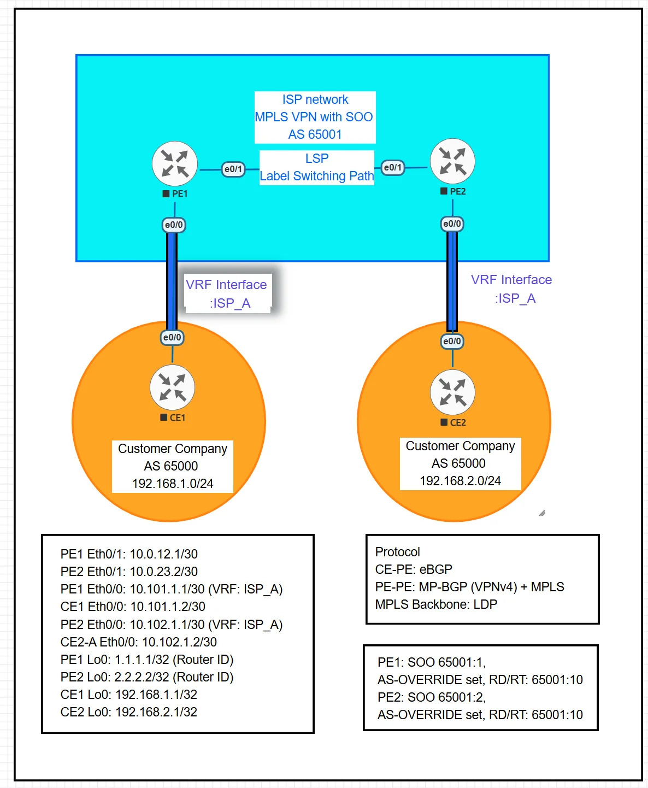

# MPLS BGP VPN with SOO



## Summary

MPLS L3VPN configuration supporting same customer AS number (AS 65000) at both sites. Site of Origin (SOO) prevents routing loops with unique site identifiers, while AS-OVERRIDE enables same-AS communication by replacing customer AS in BGP updates.

## Lab Environment

**Emulation Platform:**
- Hypervisor: VMware Workstation Pro
- Network Emulator: EVE-NG Community Edition
- Base OS: Ubuntu 22.04 LTS
- Router Platform: Cisco IOL (IOS on Linux)
- IOS Version: 15.x

**Topology:**
See topology.png for network diagram and device connections.

All configurations have been tested and verified in this environment.


## 📁 Lab Files

**EVE-NG Topology File:** [Download 2MPLS-VPN-SOO.unl](https://raw.githubusercontent.com/mikio-abe/network-lab-03-mpls-bgp-vpn-soo/main/2MPLS-VPN-SOO.unl)

Right-click the link above and select "Save Link As..." to download the complete EVE-NG lab topology file.

### Configuration Files:
- [CE1.cfg](https://raw.githubusercontent.com/mikio-abe/network-lab-03-mpls-bgp-vpn-soo/main/CE1.cfg) - Customer Edge 1 (AS 65000)
- [CE2.cfg](https://raw.githubusercontent.com/mikio-abe/network-lab-03-mpls-bgp-vpn-soo/main/CE2.cfg) - Customer Edge 2 (AS 65000 - Same AS!)
- [PE1.cfg](https://raw.githubusercontent.com/mikio-abe/network-lab-03-mpls-bgp-vpn-soo/main/PE1.cfg) - Provider Edge 1 (VRF + SOO + AS-OVERRIDE)
- [PE2.cfg](https://raw.githubusercontent.com/mikio-abe/network-lab-03-mpls-bgp-vpn-soo/main/PE2.cfg) - Provider Edge 2 (VRF + SOO + AS-OVERRIDE)

## Verification

```
show bgp vpnv4 unicast vrf ISP_A
show ip bgp vrf ISP_A 192.168.2.0
ping vrf ISP_A 192.168.2.1 source 192.168.1.1
```

**Blog:** [Medium Article](https://medium.com/@miki2013smp/ai-assisted-mpls-vpn-learning-from-standard-configuration-to-production-scenarios-9f8a88b4c2c3)
